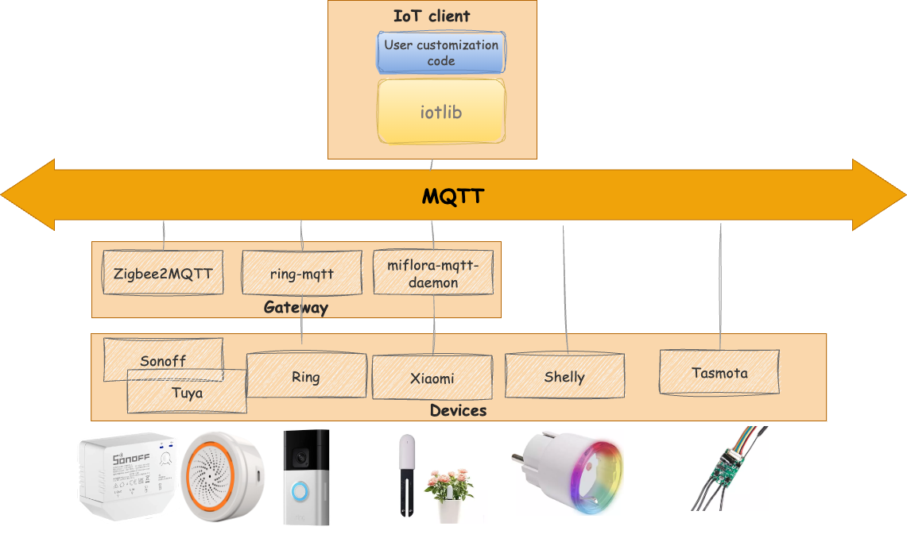

# iotlib

"Less is More - Powering Your IoT Solutions with MQTT integration"

## Description

**iotlib** is a versatile python library built upon PahoTM MQTT, designed to simplify IoT application development without the overpromises of no-code platforms.




Key features includes:

- Offers a **programmatic alternative** to traditional home automation platforms such as openHAB, Home Assistant, and Jeedom, providing more flexibility and control.
- A robust communication bridge leveraging the **MQTT protocol**, ensuring reliable data transfer between devices.
- Designed with a **protocol-agnostic** approach, our system supports both direct device integration over MQTT (such as Shelly or Tasmota devices) and gateway integration (via platforms like Zigbee2MQTT, ring to MQTT or miflora to MQTT) . This offers enhanced flexibility in integrating various devices.
- Comprehensive support for the creation and management of **virtual devices**, simplifying the integration between devices models, providers et protocols.
- Implementation of the **Observer design pattern**, enabling automatic triggering of actions on switches based on sensor value changes.


## Documentation

You can access the full documentation at [slassabe.github.io/iotlib](https://slassabe.github.io/iotlib/)

## Getting Started

```bash
git clone https://github.com/slassabe/iotlib.git

cd iotlib
sudo pip3 install -r requirements.txt
```

## Related projects

- [paho-mqtt](https://github.com/eclipse/paho.mqtt.python) : Eclipse Paho™ MQTT Python Client
- [miflora-mqtt-daemon](https://github.com/ThomDietrich/miflora-mqtt-daemon) : Xiaomi Mi Flora Plant Sensor MQTT Client/Daemon
- [ring-mqtt](https://github.com/tsightler/ring-mqtt) : Ring devices to MQTT Bridge
- [zigbee2mqtt](https://github.com/Koenkk/zigbee2mqtt) : Allows you to use your Zigbee devices without the vendor's bridge or gateway.