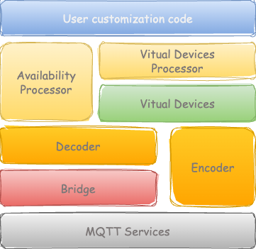

# Core Concepts

This section provides an overview of the fundamental concepts and principles that underpin this project. Understanding these concepts will help you to use and contribute to the project more effectively.



## MQTT Service

The MQTT service is essential for establishing a connection to an MQTT broker and handling events such as connect and disconnect. It also allows for the addition of custom handlers for these events. Furthermore, main loop facilities are necessary for the continuous processing of these events. This support is provided by the `MQTTClient` class.

## MQTT Bridge

MQTT Bridges serve as the intermediary between the MQTT Services and the decoding layer. They manage several key tasks:

- **MQTT Connections**: Establish and maintain connections with the MQTT broker.
- **Message Callbacks**: Handle incoming MQTT messages and pass them to the appropriate decoder.
- **Availability Updates**: Monitor and report the online/offline status of MQTT clients.
- **Value Handling**: Process the decoded values and pass them to the appropriate handlers.

For example, when a message is received from an MQTT client, the MQTT Bridge will pass the message to the appropriate decoder based on the topic of the message. Once the message is decoded, the MQTT Bridge will then pass the decoded values to the appropriate handlers for further processing.

## Coding and decoding message

Each device model and protocol uses its own unique MQTT-based exchange format for encoding and decoding messages.

- Decoding functionalities are essential for extracting values from messages received from `sensors` and `operables` devices.
- Encoding functionalities are utilized by `operables` to send commands to the devices.

A separate codec is required to handle each protocol, ensuring accurate and efficient communication.

## Virtual Devices 

Virtual devices serve as an abstraction layer over physical devices, facilitating interoperability across different types of devices. These virtual devices are organized into a hierarchical structure as follows:

- **Sensors**: These virtual devices are responsible for measuring and reporting various environmental conditions. They include:
  - Temperature Sensor
  - Humidity Sensor
  - Light Sensor
  - Conductivity Sensor
  - Button Sensor
  - Motion Sensor
  - Analog-to-Digital Converter

- **Operables**: These virtual devices are capable of performing certain actions. They include:
  - Alarm
  - Switch

Each physical device is associated with one or more virtual devices, which handle the processing and management of data. For instance, an air sensor might be associated with a Temperature Sensor and a Humidity Sensor virtual device, which handle temperature and humidity data respectively.
This support is provided by the `VirtualDevice` class.

## Codec Factory

The process of codec instantiation can be tedious as it requires knowledge of the class name and the necessary arguments. To simplify this process, a codec factory is provided. By specifying the protocol and model you need, the factory will create the required instance for you.

```python
import iotlib
factory = iotlib.factory.CodecFactory()
codec = factory.create_instance(model=Model.TUYA_TS0002,
                                protocol=Protocol.Z2M,
                                device_name=DEVICE_NAME,
                                v_switch0=v_switch0,
                                v_switch1=v_switch1,
```

Below is a table outlining the available codecs.

|Protocol| Model        | Codec Class   | Virtual Device Parameters |
| ------ | ------------ | ------------- | --------------------------|
| Z2M    | TUYA_TS0002  | TuYaTS0002    | v_switch0, v_switch1      |
| Homie  | MIFLORA      | In progress   |                           |
| Z2M    | NEO_ALARM    | NeoNasAB02B2  | v_alarm                   |
| RING   | RING_CAMERA  | In progress   |                           |
| TASMOTA| SHELLY_PLUGS | In progress   |                           |
| SHELLY | SHELLY_PLUGS | In progress   |                           |
| TASMOTA| SHELLY_UNI   | In progress   |                           |
| SHELLY | SHELLY_UNI   | In progress   |                           |
| Z2M    | TUYA_SOIL    | Ts0601Soil    | v_temp, v_humi            |
| Z2M    | ZB_AIRSENSOR | SonoffSnzb02  |                           |
| Z2M    | ZB_BUTTON    | SonoffSnzb01  | v_button                  |
| Z2M    | ZB_MOTION    | SonoffSnzb3   | v_motion                  |
| Z2M    | ZB_MINI      | SonoffZbminiL | v_switch                  |


## Processor

Processors are utilized to customize the behavior of devices for processing updates from virtual devices and sensors. They perform the following functions:

- **On Device Availability**:
  - Log the availability status of the device.
  - Publish the availability status to an MQTT topic for real-time tracking.

- **On Virtual Device Updates**:
  - Log updates from virtual devices for record-keeping and debugging.
  - Process button press actions on registered switches and alarms, allowing for interactive control.
  - Handle motion sensor state changes and trigger registered switches when occupancy is detected, enabling automated responses.
  - Publish property updates to an MQTT broker for monitoring purpose.

The predefined behavior provided by these processors can be extended with your own code by subclassing the `AvailabilityProcessor` and `VirtualDeviceProcessor` classes. This allows for greater flexibility and customization to meet specific needs.
